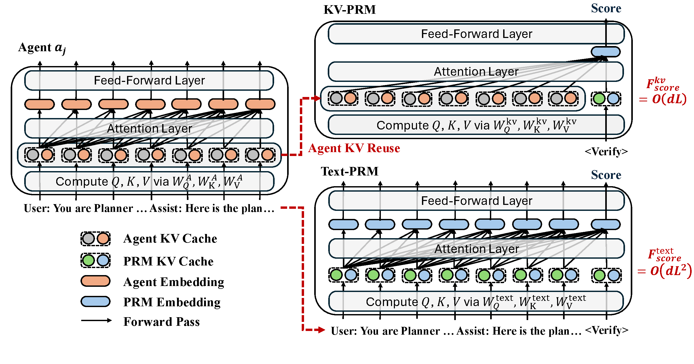

<div align="center">

# KV-PRM

### Efficient Process Reward Modeling via KV-Cache Transfer for Multi-Agent Test-Time Scaling

Peng Kuang<sup>1</sup> · Haibo Jin<sup>1</sup> · Xiaoyu Han<sup>1</sup> ·
Yanli Wang<sup>2</sup> · Xiaopeng Yuan<sup>1</sup> · Ye Yu<sup>1</sup> ·
Kaidi Xu<sup>3</sup> · Haohan Wang<sup>1</sup>

<sup>1</sup>University of Illinois Urbana-Champaign ·
<sup>2</sup>Imperial College London ·
<sup>3</sup>City University of Hong Kong

[](https://arxiv.org/abs/2607.09153)
[](https://arxiv.org/pdf/2607.09153)
[](https://www.python.org/)
[](LICENSE)

**Official implementation of KV-PRM.**

</div>

<p align="center">
  
</p>

<p align="center">
  <em>KV-PRM reuses the generator's KV cache and scores a trajectory with a
  single verify token, avoiding full-text re-encoding.</em>
</p>

## Overview

Process reward models are central to test-time search, but conventional
text-PRMs repeatedly re-encode the complete reasoning trajectory. This becomes
a major bottleneck for long multi-agent rollouts.

KV-PRM transfers the KV cache already produced during generation to a
lightweight LoRA reward adapter. The adapter reads the cached trajectory through
a single verify token, reducing each scoring call from `O(dL²)` to `O(dL)` while
remaining compatible with beam search, MCTS, and weighted voting. In the paper,
KV-PRM matches or improves upon text-PRM accuracy while reducing scoring FLOPs
by up to 5,000×, latency by up to 37×, and per-sequence memory by 34.2×.

## Installation

The code targets Linux, Python 3.11, and CUDA-capable NVIDIA GPUs.

```bash
git clone https://github.com/KrumperIsOK/KV_PRM.git
cd KV_PRM

python3.11 -m venv .venv
source .venv/bin/activate
python -m pip install --upgrade pip
python -m pip install -r requirements.txt
```

Model and dataset artifacts are downloaded through Hugging Face when needed.
Install a CUDA-compatible `bitsandbytes` build separately if you plan to use
4-bit model loading.

## Usage

The examples below demonstrate the end-to-end workflow. Runtime defaults and
all optional arguments are documented by each command's `--help` output.

### 1. Generate MCTS rollouts

```bash
python src/run_mcts.py --n 8
```

Rollout trees are written under `artifacts/trees/`. Multi-agent communication
follows the graph topology selected with `--mas`.

### 2. Build PRM training data

```bash
python src/train/preprocess_data.py \
  --input artifacts/trees/<run-directory> \
  --output artifacts/data/prm_train.jsonl
```

### 3. Train KV-PRM

```bash
torchrun --standalone --nproc_per_node=1 src/train/train_kv_prm.py \
  --train_file artifacts/data/prm_train.jsonl \
  --output_dir artifacts/checkpoints/kv-prm \
  --do_train \
  --report_to none
```

KV-cache readout is the default. Use `--prm_encoding text` to train the matched
text-PRM baseline.

### 4. Generate and score evaluation trees

```bash
python src/experiments/eval.py \
  --prm_dir artifacts/checkpoints/kv-prm/checkpoint-<step> \
  --build_tree \
  --score_policy_logprob \
  --score_prm
```

Generated trees, checkpoints, tables, and logs are written beneath the ignored
`artifacts/` directory.

## Data

The repository contains a compact MATH snapshot at `data/math.parquet`. Other
supported datasets are loaded from Hugging Face by `src/dataset_handler.py`.
Dataset artifacts remain subject to their original licenses and terms.

## Citation

If you find KV-PRM useful in your research, please cite:

```bibtex
@article{kuang2026kvprm,
  title   = {{KV-PRM}: Efficient Process Reward Modeling via {KV}-Cache Transfer for Multi-Agent Test-Time Scaling},
  author  = {Kuang, Peng and Jin, Haibo and Han, Xiaoyu and Wang, Yanli and Yuan, Xiaopeng and Yu, Ye and Xu, Kaidi and Wang, Haohan},
  journal = {arXiv preprint arXiv:2607.09153},
  year    = {2026}
}
```

## Acknowledgement

This codebase builds on the multi-agent rollout and process-reward modeling
foundation introduced by [MASPRM](https://arxiv.org/abs/2510.24803). We thank
its authors for releasing their work.

## License

This project is released under the [MIT License](LICENSE).
