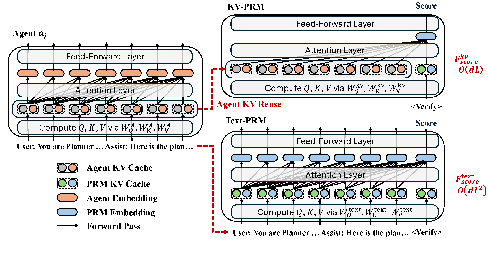

<div align="center">

# KV-PRM

### Efficient Process Reward Modeling via KV-Cache Transfer for Multi-Agent Test-Time Scaling

Peng Kuang<sup>1</sup> · Haibo Jin<sup>1</sup> · Xiaoyu Han<sup>1</sup> ·
Yanli Wang<sup>2</sup> · Xiaopeng Yuan<sup>1</sup> · Ye Yu<sup>1</sup> ·
Kaidi Xu<sup>3</sup> · Haohan Wang<sup>1</sup>

<sup>1</sup>University of Illinois Urbana-Champaign ·
<sup>2</sup>Imperial College London ·
<sup>3</sup>City University of Hong Kong

**Accepted at NeurIPS 2026**

[](https://krumperisok.github.io/KV-PRM/)
[](https://arxiv.org/abs/2607.09153)
[](https://arxiv.org/pdf/2607.09153)
[](https://www.python.org/)
[](LICENSE)

**Official implementation of KV-PRM.**

</div>

<p align="center">
  
</p>

<p align="center">
  <em>KV-PRM reuses the generator's KV cache and scores a trajectory with a
  single verify token, avoiding full-text re-encoding.</em>
</p>

## Overview

Process reward models are central to test-time search, but conventional
text-PRMs repeatedly re-encode the complete reasoning trajectory. This becomes
a major bottleneck for long multi-agent rollouts.

KV-PRM transfers the KV cache already produced during generation to a
lightweight LoRA reward adapter. The adapter reads the cached trajectory through
a single verify token, reducing each scoring call from `O(dL²)` to `O(dL)` while
remaining compatible with beam search, MCTS, and weighted voting. In the paper,
KV-PRM matches or improves upon text-PRM accuracy while reducing scoring FLOPs
by up to 5,000×, latency by up to 37×, and per-sequence memory by 34.2×.

## Installation

The code targets Linux, Python 3.11, and CUDA-capable NVIDIA GPUs.

```bash
git clone https://github.com/KrumperIsOK/KV-PRM.git
cd KV-PRM

python3.11 -m venv .venv
source .venv/bin/activate
python -m pip install --upgrade pip
python -m pip install -r requirements.txt
```

Model and dataset artifacts are downloaded through Hugging Face when needed.
Install a CUDA-compatible `bitsandbytes` build separately if you plan to use
4-bit model loading.

## Usage

The examples below demonstrate the end-to-end workflow. Runtime defaults and
all optional arguments are documented by each command's `--help` output.

### 1. Generate MCTS rollouts

```bash
python src/run_mcts.py --n 8
```

Rollout trees are written under `artifacts/trees/`. Multi-agent communication
follows the graph topology selected with `--mas`.

### 2. Build PRM training data

```bash
python src/train/preprocess_data.py \
  --input artifacts/trees/<run-directory> \
  --output artifacts/data/prm_train.jsonl
```

### 3. Train KV-PRM

```bash
torchrun --standalone --nproc_per_node=1 src/train/train_kv_prm.py \
  --train_file artifacts/data/prm_train.jsonl \
  --output_dir artifacts/checkpoints/kv-prm \
  --do_train \
  --report_to none
```

KV-cache readout is the default. Use `--prm_encoding text` to train the matched
text-PRM baseline.

### 4. Generate and score evaluation trees

```bash
python src/experiments/eval.py \
  --prm_dir artifacts/checkpoints/kv-prm/checkpoint-<step> \
  --build_tree \
  --score_policy_logprob \
  --score_prm
```

Generated trees, checkpoints, tables, and logs are written beneath the ignored
`artifacts/` directory.

## Data

The repository contains a compact MATH snapshot at `data/math.parquet`. Other
supported datasets are loaded from Hugging Face by `src/dataset_handler.py`.
Dataset artifacts remain subject to their original licenses and terms.

## Citation

If you find KV-PRM useful in your research, please cite:

Use the [official arXiv BibTeX export](docs/citation.bib), imported verbatim.
Its [provenance record](docs/citation-provenance.json) records the source URL,
retrieval date, and SHA-256 checksum. The paper has been accepted at NeurIPS
2026; the citation retains the metadata supplied by arXiv until an official
proceedings export is available. This export replaces the previous unverified
README and `CITATION.cff` entries.

## Project page

The project page lives in [`docs/`](docs/index.html) and can be served by
GitHub Pages from this repository. No additional repository, framework, build
step, or paid hosting is needed for this public repository.

To preview locally:

```bash
python3 -m http.server 8000 --directory docs
```

Open <http://localhost:8000>.

To publish after pushing these files to `main`:

1. Open the repository's [Settings → Pages](https://github.com/KrumperIsOK/KV-PRM/settings/pages).
2. Under **Build and deployment**, choose **Deploy from a branch**.
3. Select **main** and **/docs**, then click **Save**.
4. Wait for the Pages deployment to finish. The site will be available at
   <https://krumperisok.github.io/KV-PRM/>.

Future changes to `docs/` publish automatically when pushed to `main`.
See [GitHub's publishing instructions](https://docs.github.com/en/pages/getting-started-with-github-pages/configuring-a-publishing-source-for-your-github-pages-site).
The overview and latency comparison images in `docs/assets/` are copies of
`assets/kv-prm-overview.png` and `assets/latency_comparison.png`; update both
locations when replacing either figure.

## Acknowledgement

This codebase builds on the multi-agent rollout and process-reward modeling
foundation introduced by [MASPRM](https://arxiv.org/abs/2510.24803). We thank
its authors for releasing their work.

## License

This project is released under the [MIT License](LICENSE).
